# n8n Queue Mode Production Template for Coolify

**Deploy production-ready n8n with 15 concurrent workers on Coolify in 15 minutes**

## 📖 Background

I recently published a [comprehensive guide on deploying n8n queue mode with Docker Compose](https://nextgrowth.ai/scaling-n8n-queue-mode-docker-compose/) on a VPS. It works—but it requires manual reverse proxy configuration, SSL certificate management, and healthcheck debugging. **Hours of setup before your first workflow even runs.**

Then I discovered **Coolify could handle all of that automatically.**

Same production-grade queue mode architecture. Same 7x performance improvement. But with **one-click SSL, automatic reverse proxy, and built-in monitoring**—without sacrificing the security hardening and optimization strategies that make it truly production-ready.

This repository contains the battle-tested Docker Compose template that combines Coolify's deployment simplicity with the production configurations from my original guide.

---

## 📋 Table of Contents

- [What This Solves](#-what-this-solves)
- [Why Coolify for n8n Queue Mode?](#-why-coolify-for-n8n-queue-mode)
- [Quick Start](#-quick-start)
- [Deployment Steps](#-deployment-steps)
  - [Step 1: Create Project](#step-1-create-a-new-project-in-coolify)
  - [Step 2: Select Template](#step-2-select-the-n8n-queue-mode-template)
  - [Step 3: Configure Settings](#step-3-configure-your-domain-and-deployment-options)
  - [Step 4: Deploy & Monitor](#step-4-deploy-and-monitor-logs)
  - [Step 5: Verify Production Readiness](#step-5-verify-production-readiness)
- [Critical: Backup Encryption Key](#-critical-backup-encryption-key)
- [Troubleshooting Common Issues](#-troubleshooting-common-issues)
- [Advanced Topics](#-advanced-topics)
- [FAQ](#-frequently-asked-questions)
- [Contributing](#-contributing)

---

## 🎯 What This Solves

**The Problem:**

❌ **SaaS platforms are expensive:** Pay-per-execution pricing compounds fast. AI workflows with GPT-4/Claude calls hit pricing tiers quickly.  
❌ **Manual Docker is overwhelming:** Reverse proxies, SSL certificates, healthcheck debugging, Redis configuration—hours of work.  
❌ **Existing guides are incomplete:** Most Coolify tutorials skip Redis password protection, execution pruning, and security hardening.  
❌ **No visibility into costs:** Running 40+ AI models without metrics? You're flying blind on API spending.

**This Solution:**

✅ **Production-ready in 15 minutes:** One-click SSL, automatic reverse proxy, container orchestration handled by Coolify.  
✅ **7x performance improvement:** Queue mode with 15 concurrent workers vs single-process execution. ([Official n8n benchmark](https://blog.n8n.io/the-n8n-scalability-benchmark/))  
✅ **Complete security hardening:** Redis password protection, container isolation (`no-new-privileges`), environment variable blocking.  
✅ **AI cost visibility:** Built-in metrics endpoint tracks executions by node type.  
✅ **Database sustainability:** Automatic 14-day execution pruning prevents database bloat.  

---

## 🏗️ Why Coolify for n8n Queue Mode?

### Coolify vs Manual VPS Setup

| Feature | Manual Docker Setup | Coolify + This Template |
|---------|---------------------|------------------------|
| **Reverse Proxy** | Configure nginx/Traefik manually | ✅ Automatic (built-in) |
| **SSL Certificates** | Manual Let's Encrypt + cron | ✅ Automatic renewal |
| **Setup Time** | 4-6 hours | ✅ 15 minutes |
| **Updates** | Manual image pulls + restart | ✅ One-click in dashboard |
| **Monitoring** | Setup Prometheus/Grafana | ✅ Built-in container stats |
| **Rollback** | Manual container management | ✅ One-click previous deployment |
| **Domain Management** | Manual DNS + config files | ✅ UI-based domain setup |
| **Multi-App Hosting** | Complex nginx configs | ✅ Deploy unlimited apps |

### What You Keep from Manual Setup

This template preserves the **production optimizations** from manual deployments:

- ✅ Redis password protection (missing in default Coolify templates)
- ✅ 14-day execution pruning (prevents database bloat)
- ✅ Metrics endpoint for AI cost tracking
- ✅ Container security hardening (`no-new-privileges`, env blocking)
- ✅ Optimized worker concurrency for your VPS size
- ✅ PostgreSQL required for queue mode (not optional SQLite)

**Best of both worlds:** Coolify's automation + production-grade configuration.

---

## 🚀 Quick Start

### Prerequisites

- ✅ Coolify installed on Ubuntu VPS ([Installation Guide](https://coolify.io/docs/installation))
- ✅ Domain with A record pointing to your VPS IP
- ✅ **8GB RAM minimum** (4GB for testing, 16GB+ for high-volume)
- ✅ 4 CPU cores recommended

---

## 🚀 Deployment Steps

### Step 1: Create a New Project in Coolify

1. **Log into your Coolify dashboard**
2. **Navigate to Projects** (left sidebar) → Click **+ Add**
3. **Name your project:**
   - Example: `n8n-automation` or `n8n-production`
4. Click **Continue**

---

### Step 2: Select the n8n Queue Mode Template

1. **On the Resource page**, select your production server → Click **+ Add New Resource**

2. **Search for n8n:**
   - Type `n8n` in the search box to filter services
   - You'll see three n8n deployment options

3. **Choose: "N8N With Postgres And Worker"**
   - ✅ This is the queue mode template with workers pre-configured
   - Description: *"n8n is an extendable workflow automation tool with queue mode and workers"*

**Why this template?**
- Already includes PostgreSQL + Redis + Worker structure
- We'll enhance it with production configurations in the next step

---

### Step 3: Configure Your Domain and Deployment Options

After selecting "N8N With Postgres And Worker," you'll be directed to the Configuration page.

#### 3.1 Configure Your Custom Domain

**Prerequisite:** DNS A record pointing your domain to VPS IP address

1. Click the **Edit** button next to the auto-generated URL
2. Enter your custom domain: `n8n.yourdomain.com`
3. Coolify will automatically:
   - ✅ Configure SSL certificate (Let's Encrypt)
   - ✅ Set up reverse proxy (Traefik)
   - ✅ Enable HTTPS redirect

---

#### 3.2 Replace with Production Docker Compose

**Critical:** Coolify's default template is good for testing but missing production essentials.

**Copy our battle-tested configuration:**

👉 **[docker-compose.yml](docker-compose.yml)** from this repository

**What's enhanced in our template:**

| Feature | Default Template | Our Production Template |
|---------|------------------|------------------------|
| Redis Password | ❌ No password | ✅ Password-protected |
| Execution Pruning | ❌ Disabled | ✅ 14-day auto-cleanup |
| Metrics | ❌ Disabled | ✅ Full observability |
| Security | ❌ Basic | ✅ Container hardening + env blocking |
| Worker Concurrency | ⚠️ Generic | ✅ Tuned for VPS size |

**Instructions:**

1. **Scroll down** to the Docker Compose editor in Coolify
2. **Select all** existing template code (Ctrl+A)
3. **Delete** and **paste** our production template
4. **⚠️ Do NOT click Deploy yet** - configuration required

---

#### 3.3 Configure Critical Settings

Before deploying, you **must** update these settings or deployment will fail:

<details>
<summary><strong>🔒 Redis Password (CRITICAL - 3 Locations)</strong></summary>

**Why:** Prevents unauthorized access to your workflow queue.

**Generate password:**

```bash
openssl rand -base64 16
# Example output: 6+tzZVrH4gIXtEzQnIbPHw==
```

**Replace `REPLACE_WITH_YOUR_REDIS_PASSWORD` in 3 locations:**

| Location | Line # | What to Find |
|----------|--------|--------------|
| **n8n main** | ~35 | `QUEUE_BULL_REDIS_PASSWORD=REPLACE_WITH_YOUR_REDIS_PASSWORD` |
| **n8n worker** | ~88 | `QUEUE_BULL_REDIS_PASSWORD=REPLACE_WITH_YOUR_REDIS_PASSWORD` |
| **Redis command** | ~170 | `- REPLACE_WITH_YOUR_REDIS_PASSWORD` |

**⚠️ All three MUST be identical** (most common deployment failure)

**Visual guide:**


</details>

<details>
<summary><strong>🌍 Timezone (4 Locations)</strong></summary>

**Why:** Ensures scheduled workflows run at correct times.

**Update in 4 locations** (lines ~40, ~95, ~145, ~180):

```yaml
- GENERIC_TIMEZONE=Asia/Singapore  # ← Change this
- TZ=Asia/Singapore                # ← Must match above
```

**Find your timezone:** [TZ Database List](https://en.wikipedia.org/wiki/List_of_tz_database_time_zones)

**Common examples:**
- US East: `America/New_York`
- US West: `America/Los_Angeles`
- UK: `Europe/London`
- Singapore: `Asia/Singapore`
- Australia: `Australia/Sydney`

**⚠️ Both must match** or scheduled workflows run at wrong times.

</details>

<details>
<summary><strong>⚡ Worker Concurrency (1 Location)</strong></summary>

**Why:** Controls how many workflows run in parallel.

**Adjust based on your VPS** (line ~90):

| VPS RAM | CPU Cores | Recommended Concurrency |
|---------|-----------|------------------------|
| 4GB | 2 cores | `5-8` |
| 8GB | 4 cores | `10-15` |
| 16GB | 8 cores | `20-25` |
| 32GB | 16 cores | `30-40` |

```yaml
command: worker --concurrency=15  # ← Change this number
```

**Formula:** `CPU Cores × 2.5` for AI-heavy workflows

</details>

---

#### 3.4 Save Configuration

**Before clicking Deploy, verify:**

- ✅ Redis password replaced in **all 3 locations**
- ✅ Timezone set in **all 4 locations**
- ✅ Worker concurrency adjusted for your VPS

**Click "Save"** in Coolify

---

### Step 4: Deploy and Monitor Logs

#### 4.1 Start Deployment

1. **Click "Deploy"** button (top right in Coolify)
2. Coolify will:
   - Pull Docker images (n8n, PostgreSQL, Redis)
   - Create persistent volumes
   - Start all containers
   - Configure internal networking

**Expected deployment time:** 2-3 minutes

---

#### 4.2 Monitor Deployment Progress

**Watch real-time logs** in Coolify's Logs tab.

**Success indicators to look for:**

```
✅ Pulling image: docker.n8n.io/n8nio/n8n:latest
✅ Container n8n-xxxxxxxx Created
✅ Container n8n-xxxxxxxx Started
✅ Container n8n-worker-xxxxxxxx Started
✅ Container postgresql-xxxxxxxx Started (healthy)
✅ Container redis-xxxxxxxx Started (healthy)
```

**When you see:** `Container n8n-xxxxxxxx Started` → Close the logs window

---

#### 4.3 Verify Container Health

**Check all containers are running:**

```bash
docker ps --format "table {{.Names}}\t{{.Status}}"
```

**Expected output:**

```
NAMES                STATUS
n8n-xxx              Up (healthy)
n8n-worker-xxx       Up (healthy)
postgresql-xxx       Up (healthy)
redis-xxx            Up (healthy)
```

**✅ All show "Up"** = Deployment successful  
**❌ "Restarting" or "Exited"** = See [Troubleshooting](#-troubleshooting-common-issues)

---

### Step 5: Verify Production Readiness

A successful deployment is just the starting point. This section validates that **queue mode is actually working** and all components are communicating correctly.

---

### 5.1 Access n8n Interface

**Navigate to your domain:**
```
https://n8n.yourdomain.com
```

**✅ If SSL is working:**
- You'll see a secure connection (padlock icon)
- n8n owner account creation screen appears

**❌ If you see SSL errors:**
- Wait 2-3 minutes for Let's Encrypt certificate provisioning
- Check DNS A record points to correct IP
- Verify domain configuration in Coolify

---

#### 5.2 Create Owner Account

**First-time setup screen:**

- **Email:** Your email address
- **Password:** Strong password (20+ characters recommended)
- **First Name / Last Name:** Your details

Click **Continue** to create your account.

**⚠️ This is the admin account** - store credentials securely (password manager)

---

#### 5.3 Verify Queue Mode Active

**Method 1: Check Environment Variable (Quick)**

```bash
docker exec n8n-xxx printenv EXECUTIONS_MODE
```

**Expected:** `queue`  
**If shows `regular`:** Queue mode not enabled (check docker-compose configuration)

---

**Method 2: Check Worker Logs (Detailed)**

```bash
docker logs n8n-worker-xxx --tail 20
```

**Expected output:**

```
✅ n8n worker is now ready
✅ Concurrency: 15
✅ Registered runner "JS Task Runner"
```

**❌ If you see errors:**
```
Error: Redis connection refused
Error: NOAUTH Authentication required
```
→ Redis password mismatch - verify all 3 locations have identical passwords

---

#### 5.4 Test Redis Connection

**Verify worker can communicate with Redis:**

```bash
# Replace YOUR_PASSWORD with your actual Redis password
docker exec redis-xxx redis-cli -a "YOUR_PASSWORD" ping
```

**Expected:** `PONG`  
**If error:** Password mismatch or Redis not running

---

#### 5.5 Test Concurrent Execution

**This validates queue mode is actually distributing work to workers.**

**Create test workflow:**

1. In n8n UI: Click **+ New Workflow**
2. Add **Manual Trigger** node (left panel)
3. Add **Code** node, paste this:

```javascript
const delay = ms => new Promise(resolve => setTimeout(resolve, ms));
await delay(3000); // 3 second delay

return {
  json: {
    message: "Queue mode working!",
    executionId: $execution.id,
    timestamp: new Date().toISOString()
  }
};
```

4. Click **Save** (name it "Queue Mode Test")
5. **Click "Execute Workflow" 15 times rapidly** (as fast as you can click)

**Success criteria:**

✅ **All 15 executions complete in 3-4 seconds total** (parallel processing)  
❌ **Takes 45+ seconds:** Executions running sequentially (queue mode failed)

**What this proves:**


- ✅ **3-4 seconds:** Workers processing 15 jobs in parallel
- ❌ **45 seconds:** Single-process execution (queue mode not working)

---

#### 5.6 Verify Metrics Endpoint

**Access metrics in browser:**

```
https://n8n.yourdomain.com/metrics
```

**Search for (Ctrl+F):**
```
n8n_workflow_executions_total
```

**Expected result:**
- Page displays Prometheus-format metrics
- `n8n_workflow_executions_total` shows execution counts
- Queue metrics present (`n8n_queue_waiting_jobs`, `n8n_queue_completed_jobs`)

**✅ Metrics visible** = Observability working (ready for AI cost tracking)  
**❌ 404 error** = Metrics not enabled (check `N8N_METRICS=true` in docker-compose)

---

#### 5.7 Production Readiness Checklist

**Before using in production, verify all items:**

- [ ] ✅ All 4 containers show "Up" status
- [ ] ✅ SSL certificate working (https:// with padlock)
- [ ] ✅ Owner account created and accessible
- [ ] ✅ Queue mode active (`EXECUTIONS_MODE=queue`)
- [ ] ✅ Workers show "ready" in logs
- [ ] ✅ Redis connection test returns `PONG`
- [ ] ✅ Concurrent execution test passes (3-4 seconds for 15 jobs)
- [ ] ✅ Metrics endpoint accessible
- [ ] ✅ **Encryption key backed up** (see [Critical Backup](#-critical-backup-encryption-key))

**All items checked?** → Your deployment is **production-ready** 🚀

**Any item failed?** → See [Troubleshooting](#-troubleshooting-common-issues) below

---

## 🔒 Critical: Backup Encryption Key

**⚠️ DO THIS IMMEDIATELY AFTER VERIFICATION**

Your n8n instance uses an auto-generated encryption key to protect all stored credentials (API keys, passwords, OAuth tokens). **If you lose this key, all credentials become permanently unrecoverable.**

### Extract Encryption Key

```bash
docker exec n8n-xxx printenv N8N_ENCRYPTION_KEY
```

**Save the output to:**
- ✅ Password manager (1Password, Bitwarden, LastPass)
- ✅ Encrypted offline backup (encrypted USB drive)
- ✅ Secure company vault/secrets manager

### Why This Matters

```mermaid
graph TB
    A[N8N_ENCRYPTION_KEY] --> B[Encrypts All Credentials]
    B --> C[OpenAI API Keys]
    B --> D[Stripe Keys]
    B --> E[AWS Credentials]
    B --> F[OAuth Tokens]
    B --> G[Database Passwords]
    
    H[Lost Key] --> I[❌ ALL Credentials<br/>Permanently Lost]
    I --> J[Cannot Decrypt]
    I --> K[Must Re-enter<br/>Everything Manually]
    
    style A fill:#10B981
    style H fill:#DC2626
    style I fill:#DC2626
```



**If you lose this key:**
- ❌ ALL stored credentials become permanently unrecoverable
- ❌ OpenAI, Stripe, AWS, OAuth tokens cannot be decrypted
- ❌ No recovery method exists
- ❌ Must manually re-enter every credential in every workflow

### Security Best Practices

**Never:**
- ❌ Commit encryption key to git repositories
- ❌ Share via Slack, email, or unencrypted channels
- ❌ Store in plain text files on the server
- ❌ Include in documentation or wiki pages

**Always:**
- ✅ Use a password manager with proper access controls
- ✅ Maintain offline encrypted backup
- ✅ Document where key is stored (not the key itself)
- ✅ Restrict access to authorized personnel only

---

## 📖 Advanced Topics

This README covers essential deployment and troubleshooting. For advanced topics, see the **[Complete Production Guide](https://nextgrowth.ai/n8n-queue-mode-coolify)**:

### Performance Optimization
- Worker concurrency tuning formulas
- Redis memory optimization strategies
- Execution pruning policies
- Database performance tuning

### Monitoring & Maintenance
- Quick health check commands
- Prometheus + Grafana integration
- Alert configuration
- Log aggregation strategies

### Scaling Strategies
- When to scale (capacity indicators)
- Vertical scaling (VPS upgrade)
- Horizontal scaling (add workers)
- Multi-worker deployment patterns
- Post-scaling verification

### Backup & Recovery
- Complete backup procedures
- Automated backup scheduling
- Disaster recovery testing
- Migration between servers

### Updates & Upgrades
- Safe upgrade procedures
- Rollback strategies
- Version compatibility checks
- Zero-downtime updates

👉 **[Read the Complete Guide](https://nextgrowth.ai/n8n-queue-mode-coolify)** for in-depth coverage of these topics.

---

## 📚 Related Resources

### n8n Queue Mode Resources
- **[n8n Queue Mode Architecture Deep-Dive](https://nextgrowth.ai/scaling-n8n-queue-mode-docker-compose/)** - Original manual deployment guide
- **[Complete n8n Coolify Production Guide](https://nextgrowth.ai/n8n-queue-mode-coolify/)** - Full tutorial with screenshots
- **[n8n Monitoring with Prometheus](https://nextgrowth.ai/n8n-monitoring-prometheus-grafana/)** - Advanced monitoring setup

### Official Documentation
- **[n8n Queue Mode Docs](https://docs.n8n.io/hosting/scaling/queue-mode/)** - Official queue mode reference
- **[Coolify Documentation](https://coolify.io/docs)** - Coolify platform docs

---

## 🤝 Contributing

Contributions welcome! Areas for improvement:

- [ ] Performance benchmarks for different VPS configurations
- [ ] Additional troubleshooting scenarios
- [ ] Alternative deployment patterns (multi-worker, etc.)
- [ ] Documentation translations
- [ ] Terraform/IaC templates for VPS provisioning

**To contribute:**
1. Fork this repository
2. Create feature branch (`git checkout -b feature/improvement`)
3. Commit changes (`git commit -m 'Add improvement'`)
4. Push to branch (`git push origin feature/improvement`)
5. Open Pull Request

---

## 📝 License

MIT License - see [LICENSE](LICENSE) file for details.

---

## ⭐ Support This Project

If this template helped you deploy production n8n:

- ⭐ **Star this repository**
- 📝 **Share your experience** (blog post, tweet, etc.)
- 🐛 **Report issues** you encounter
- 💡 **Suggest improvements** via issues/PRs

---

**Author:** [The Nguyen](https://nextgrowth.ai)  
**Blog:** [NextGrowth.ai](https://nextgrowth.ai) - AI automation and self-hosting guides
---

**Last Updated:** January 2026
**Tested with:**
- n8n: v2.1.4+
- Coolify: v4.0+
- Docker: v24.0+
- PostgreSQL: 16
- Redis: 7
